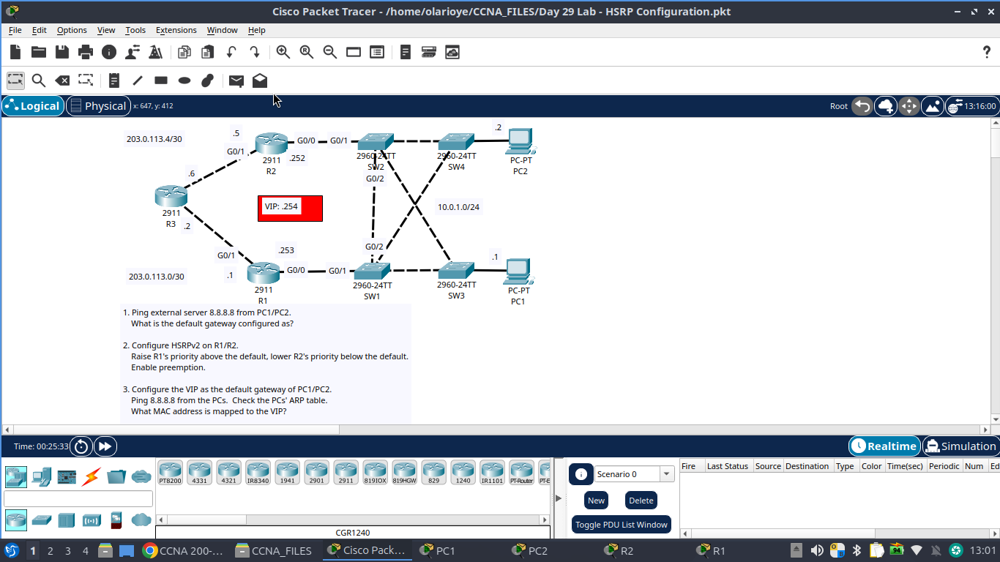
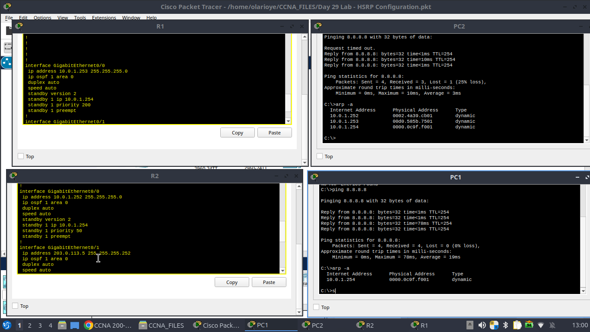

#HSRP Configuration (First Hop Redundancy)

Part of my CCNA 200-301 lab series. This lab configures HSRPv2 between two routers to provide a redundant default gateway for two PCs, sitting behind a redundantly-meshed switch layer.

## Objective

- Understand why a single default gateway is a single point of failure at Layer 3
- Configure HSRPv2 with a virtual IP (VIP) shared between two routers
- Control which router is active using priority and preemption
- Verify failover transparency from the end host's perspective (ARP table)

## Topology



| Device | Role | Interface | IP Address | Notes |
|---|---|---|---|---|
| R1 | HSRP Active | G0/1 | 10.0.1.253 /24 | Priority 200, preempt enabled |
| R2 | HSRP Standby | G0/0 | 10.0.1.252 /24 | Priority 50, preempt enabled |
| R1 | WAN link to R3 | G0/0 | 203.0.113.1 /30 | OSPF area 0 |
| R2 | WAN link to R3 | G0/1 | 203.0.113.5 /30 | OSPF area 0 |
| — | Virtual IP (VIP) | — | 10.0.1.254 | Shared HSRP gateway |
| SW1–SW4 | Layer 2 switching | — | — | Cross-connected mesh, STP active |
| PC1 | Host | — | 10.0.1.0/24 (DHCP/static) | Gateway: 10.0.1.254 |
| PC2 | Host | — | 10.0.1.0/24 (DHCP/static) | Gateway: 10.0.1.254 |

**Routing protocol:** OSPF area 0 (used to reach the external network / 8.8.8.8 test destination)

## Why HSRP Here

The switches (SW1–SW4) are wired in a redundant mesh for Layer 2 resiliency — that's STP's job, and it's a separate concern from this lab. But each PC still only has one default gateway address configured. Without HSRP, if R1 goes down, both PCs lose their route out, even though R2 is sitting right there and perfectly capable of forwarding traffic.

HSRP solves this by having R1 and R2 share a virtual IP and virtual MAC address. The PC's gateway configuration never has to change — it always points to the VIP, and HSRP decides underneath which physical router is actually answering.

## Configuration Steps

### Step 1 — Baseline check
Before touching HSRP config, confirmed each PC could reach the external test address and noted the default gateway in use.

```
C:\>ping 8.8.8.8
C:\>ipconfig
```

### Step 2 — Enable HSRPv2 and set the VIP (R1 and R2)

On R1 (intended active router):
```
interface GigabitEthernet0/1
 ip address 10.0.1.253 255.255.255.0
 standby version 2
 standby 1 ip 10.0.1.254
 standby 1 priority 200
 standby 1 preempt
```

On R2 (intended standby router):
```
interface GigabitEthernet0/0
 ip address 10.0.1.252 255.255.255.0
 standby version 2
 standby 1 ip 10.0.1.254
 standby 1 priority 50
 standby 1 preempt
```

Priority is raised above the default (100) on R1 to force it active, and lowered below default on R2. Preemption is enabled on both so that R1 reclaims the active role automatically after recovering from a failure, instead of leaving R2 active indefinitely.

### Step 3 — Point the PCs at the VIP

Both PC1 and PC2 have their default gateway set to the virtual IP, **10.0.1.254** — not to R1 or R2's physical interface address.

## Verification



From PC1:
```
C:\>ping 8.8.8.8
Reply from 8.8.8.8: bytes=32 time<1ms TTL=254
...
Ping statistics for 8.8.8.8:
    Packets: Sent = 4, Received = 4, Lost = 0 (0% loss)

C:\>arp -a
Internet Address    Physical Address    Type
10.0.1.254           0000.0c9f.f001      dynamic
```

From PC2:
```
C:\>arp -a
Internet Address    Physical Address    Type
10.0.1.252            0002.4a39.cb01      dynamic
10.0.1.253            00d0.585b.7501      dynamic
10.0.1.254            0000.0c9f.f001      dynamic
```

The key result: the VIP (10.0.1.254) resolves to a virtual MAC address (0000.0c9f.f001) — not the burned-in MAC of R1 or R2. This is what makes failover invisible to the host: the PC's ARP entry never has to change no matter which router is actually active behind the scenes.

## Key Learning Points

- **HSRP vs. STP — different layers, different jobs.** STP prevents loops among redundant Layer 2 links between switches. HSRP provides a redundant default gateway at Layer 3. A resilient network needs both; they don't substitute for each other.
- **Priority determines the active router.** Highest priority wins the active role (default is 100). Setting one router noticeably higher and the other noticeably lower avoids ambiguity.
- **Preempt matters.** Without `standby 1 preempt`, a recovered higher-priority router will not reclaim active status automatically — the standby router stays active until the next failure or manual intervention.
- **The virtual MAC is the whole trick.** Verifying it via `arp -a` on the end host is the cleanest way to prove HSRP is actually abstracting the gateway, rather than just trusting the config.
- **HSRPv2 vs v1.** Using `standby version 2` here — v2 supports a larger group number range and uses a different multicast address (224.0.0.102) than v1.

## Tools Used

- Cisco Packet Tracer
- Topology: 3x Cisco 2911 routers, 4x Cisco 2960-24TT switches, 2x PCs
