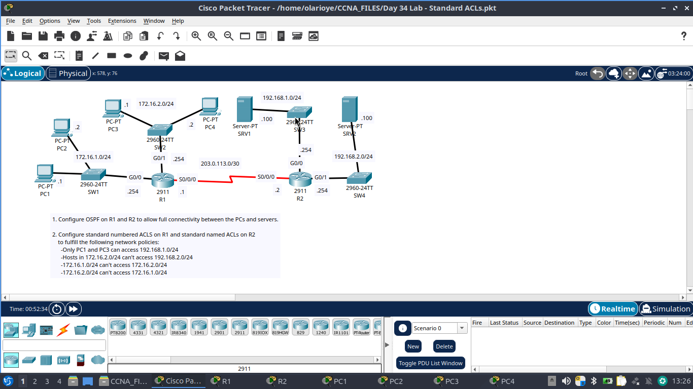
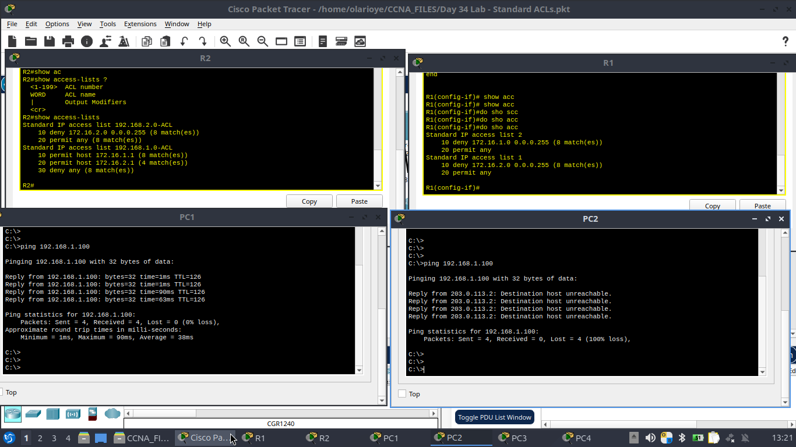
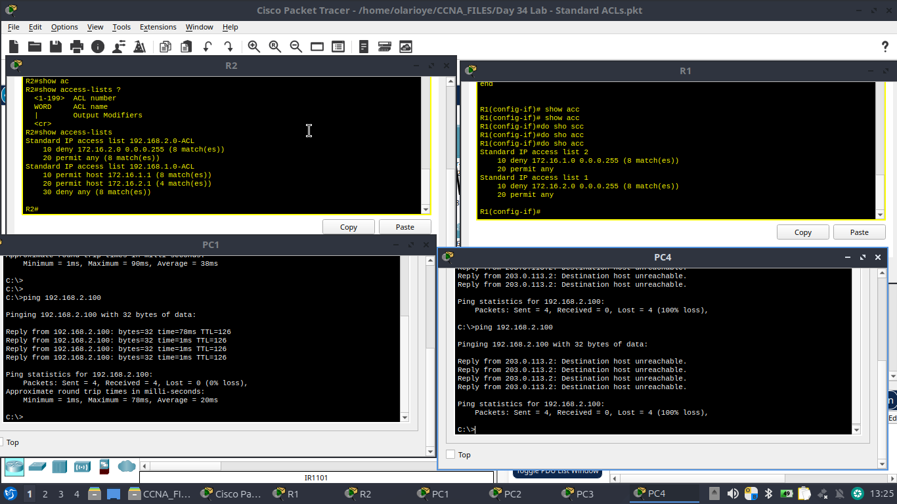

# Standard ACLs (with OSPF)

Part of my ongoing CCNA 200-301 lab series, documented in public. This lab combines OSPF-based full connectivity with standard ACLs (numbered and named) to enforce specific network access policies.

## Objectives

1. Configure OSPF on R1 and R2 so every PC and server in the topology has full connectivity.
2. Configure standard numbered ACLs on R1 and standard named ACLs on R2 to enforce the following policies:
   - Only PC1 and PC3 can access `192.168.1.0/24`
   - Hosts in `172.16.2.0/24` can't access `192.168.2.0/24`
   - `172.16.1.0/24` can't access `172.16.2.0/24`
   - `172.16.2.0/24` can't access `172.16.1.0/24`

## Topology



| Device | Interface | IP Address       | Connects to        |
|--------|-----------|-------------------|---------------------|
| R1     | G0/0      | 172.16.1.254/24   | SW1 (172.16.1.0/24) |
| R1     | G0/1      | 172.16.2.254/24   | SW2 (172.16.2.0/24) |
| R1     | S0/0/0    | 203.0.113.1/30    | R2                   |
| R2     | S0/0/0    | 203.0.113.2/30    | R1                   |
| R2     | G0/0      | 192.168.1.254/24  | SW3 (192.168.1.0/24)|
| R2     | G0/1      | 192.168.2.254/24  | SW4 (192.168.2.0/24)|
| PC1    | —         | 172.16.1.1        | SW1                  |
| PC2    | —         | 172.16.1.2        | SW1                  |
| PC3    | —         | 172.16.2.1        | SW2                  |
| PC4    | —         | 172.16.2.2        | SW2                  |
| SRV1   | —         | 192.168.1.100     | SW3                  |
| SRV2   | —         | 192.168.2.100     | SW4                  |

## Step 1 — OSPF for full connectivity

Before applying any ACLs, OSPF was enabled on both routers so every PC and server could reach every other network. This baseline matters: an ACL can only prove it's blocking traffic correctly if the underlying routing already allows that traffic through.

```
! R1
router ospf 1
 network 172.16.1.0 0.0.0.255 area 0
 network 172.16.2.0 0.0.0.255 area 0
 network 203.0.113.0 0.0.0.3 area 0

! R2
router ospf 1
 network 192.168.1.0 0.0.0.255 area 0
 network 192.168.2.0 0.0.0.255 area 0
 network 203.0.113.0 0.0.0.3 area 0
```

## Step 2 — Standard numbered ACLs on R1

R1 handles the policy that keeps the two 172.16.x.x LANs isolated from each other, using two numbered ACLs applied outbound on each LAN-facing interface.

```
! Blocks 172.16.2.0/24 from reaching 172.16.1.0/24
access-list 1 deny 172.16.2.0 0.0.0.255
access-list 1 permit any
interface g0/0
 ip access-group 1 out

! Blocks 172.16.1.0/24 from reaching 172.16.2.0/24
access-list 2 deny 172.16.1.0 0.0.0.255
access-list 2 permit any
interface g0/1
 ip access-group 2 out
```

Verified with `show access-lists` on R1:

```
Standard IP access list 2
    10 deny   172.16.1.0 0.0.0.255 (8 matches)
    20 permit any
Standard IP access list 1
    10 deny   172.16.2.0 0.0.0.255 (8 matches)
    20 permit any
```

## Step 3 — Standard named ACLs on R2

R2 controls who can reach each server subnet, using named ACLs applied outbound on the server-facing interfaces — named for readability instead of just a number.

```
! Only PC1 and PC3 can reach 192.168.1.0/24 (SRV1)
ip access-list standard 192.168.1.0-ACL
 permit host 172.16.1.1
 permit host 172.16.2.1
 deny any
interface g0/0
 ip access-group 192.168.1.0-ACL out

! 172.16.2.0/24 is blocked from reaching 192.168.2.0/24 (SRV2)
ip access-list standard 192.168.2.0-ACL
 deny 172.16.2.0 0.0.0.255
 permit any
interface g0/1
 ip access-group 192.168.2.0-ACL out
```

Verified with `show access-lists` on R2:

```
Standard IP access list 192.168.2.0-ACL
    10 deny   172.16.2.0 0.0.0.255 (8 matches)
    20 permit any
Standard IP access list 192.168.1.0-ACL
    10 permit host 172.16.1.1 (8 matches)
    20 permit host 172.16.2.1 (4 matches)
    30 deny any (8 matches)
```

## Verification — testing the policy, not just the config

The real test of an ACL isn't whether the router accepts the config — it's whether traffic actually behaves as expected.

**PC1 vs PC2 → 192.168.1.100 (SRV1):**
PC1 (an allowed host) gets full replies; PC2, on the same LAN but not in the permit list, gets "Destination host unreachable" from R2's WAN interface — proof the deny is being enforced by R2, not dropped somewhere else.



**PC3 vs PC4 → 192.168.2.100 (SRV2):**
Same pattern on the other subnet pair — PC3 gets through, PC4 is denied.



## Key learning points

- **Routing before filtering.** OSPF has to establish full reachability first — you can't validate an ACL's *deny* logic if the *permit* path was never there to begin with.
- **Standard ACLs only match source address.** They can't filter on destination or port, so "only these two hosts can reach this subnet" has to be written as explicit host-level permits followed by an implicit (or explicit) deny — there's no way to also restrict *what* those hosts do once they're in.
- **Processing is top-down with an implicit deny.** Statement order matters; a broad permit placed above a specific deny would silently defeat the policy.
- **Named ACLs read better than numbered ones** once a topology has more than a couple of lists — `192.168.1.0-ACL` tells you what it protects at a glance, `access-list 1` doesn't.
- **"Destination host unreachable" from the router's own interface** (not a timeout) is the signature of an ACL deny — a useful troubleshooting tell versus a routing failure.

---
*Day 34 of the CCNA 200-301 lab series — built and tested in Cisco Packet Tracer.*
