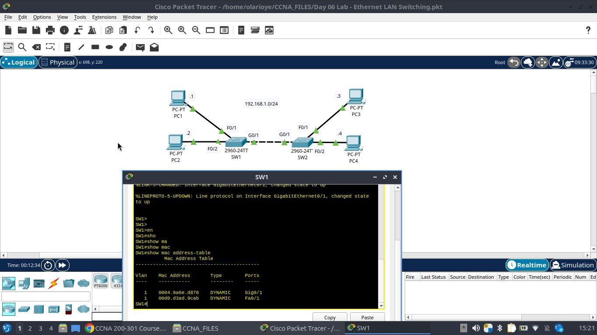
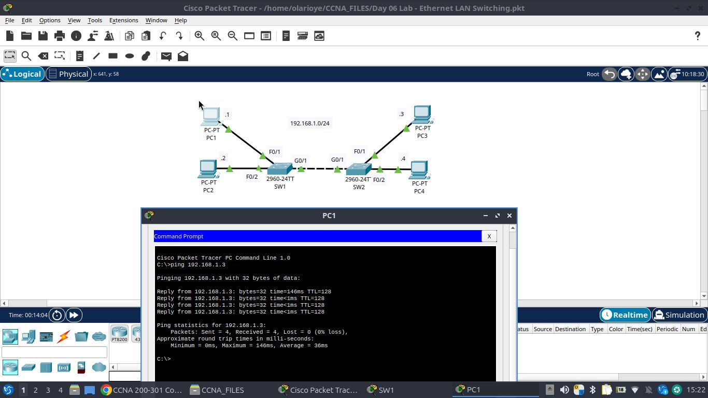
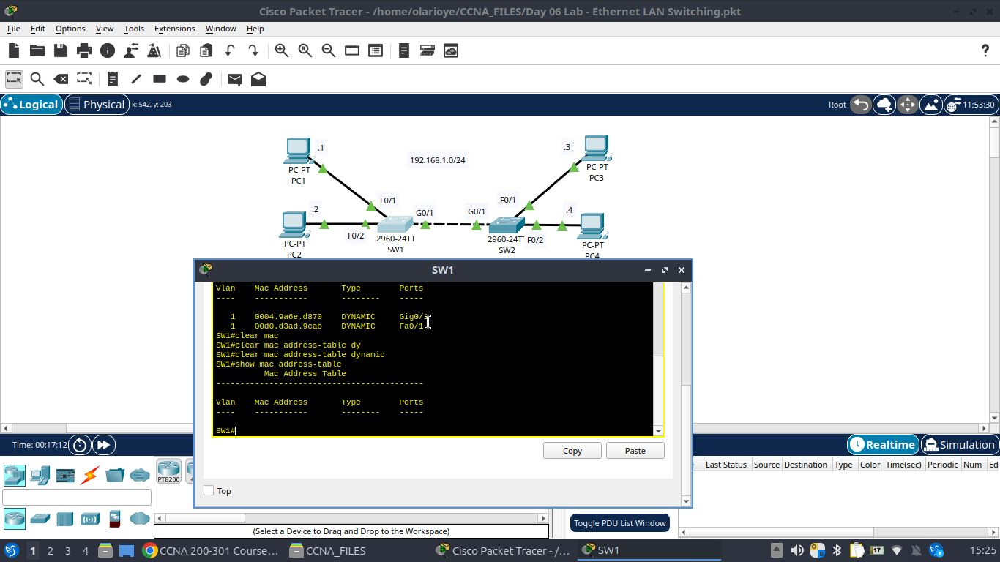

# Ethernet LAN Switching (MAC Address Table Learning)

This lab demonstrates how a Cisco Layer 2 switch **dynamically learns MAC addresses** and builds its MAC address table by observing traffic on its ports, and how that table can be cleared to reset the learning process.

## Topology

| Device | Interface | IP Address |
|--------|-----------|------------|
| PC1 | NIC | 192.168.1.1 |
| PC2 | NIC | 192.168.1.2 |
| PC3 | NIC | 192.168.1.3 |
| PC4 | NIC | 192.168.1.4 |
| SW1 (2960-24TT) | Fa0/1, Fa0/2, Gi0/1 | — |
| SW2 (2960-24TT) | Fa0/1, Fa0/2, Gi0/1 | — |

- PC1 and PC2 connect to **SW1** (Fa0/1 and Fa0/2 respectively).
- PC3 and PC4 connect to **SW2** (Fa0/1 and Fa0/2 respectively).
- SW1 and SW2 are trunked/linked together via **Gi0/1 ↔ Gi0/1**.
- All hosts share the same subnet: **192.168.1.0/24**.

## Objective

1. Observe how a switch populates its MAC address table dynamically as frames are switched.
2. Confirm reachability between hosts on different switches (PC1 → PC3).
3. Clear the dynamically learned MAC address table and confirm it resets.

## Step 1 – Initial MAC Address Table on SW1

On SW1, the following commands were used to inspect the MAC address table:

```
SW1> en
SW1# show mac address-table
```

At this point, SW1 has already learned two dynamic entries:

| Vlan | Mac Address | Type | Ports |
|------|-------------|------|-------|
| 1 | 0004.9a6e.d870 | DYNAMIC | Gig0/1 |
| 1 | 00d0.d3ad.9cab | DYNAMIC | Fa0/1 |

This shows the switch has already seen traffic sourced from a device on **Fa0/1 (PC1)** and from something reachable via **Gi0/1** (the SW1–SW2 uplink, representing a device beyond SW2, i.e. PC3 or PC4).



## Step 2 – Generate Traffic (Ping PC1 → PC3)

From **PC1's command prompt**, a ping was sent to PC3 (192.168.1.3) to generate traffic that traverses both switches:

```
C:\> ping 192.168.1.3

Reply from 192.168.1.3: bytes=32 time=146ms TTL=128
Reply from 192.168.1.3: bytes=32 time<1ms TTL=128
Reply from 192.168.1.3: bytes=32 time<1ms TTL=128
Reply from 192.168.1.3: bytes=32 time<1ms TTL=128

Ping statistics for 192.168.1.3:
    Packets: Sent = 4, Received = 4, Lost = 0 (0% loss)
Approximate round trip times in milli-seconds:
    Minimum = 0ms, Maximum = 146ms, Average = 36ms
```

The successful ping confirms end-to-end Layer 2/3 connectivity between PC1 (on SW1) and PC3 (on SW2), and this traffic is exactly what causes each switch along the path to learn (or refresh) the source MAC addresses on its ports.



## Step 3 – Clear the MAC Address Table

Back on SW1, the dynamically learned entries were cleared to demonstrate how the table is rebuilt from scratch:

```
SW1# clear mac address-table dynamic
SW1# show mac address-table
```

After clearing, the MAC address table is empty — all previously learned dynamic entries are removed, and the switch will need to relearn them the next time it sees traffic from those hosts.



## Key Takeaways

- Switches build their MAC address table **dynamically** by inspecting the **source MAC address** of every incoming frame and associating it with the port it arrived on.
- The `show mac address-table` command displays learned (dynamic), statically configured, and other entries per VLAN.
- The `clear mac address-table dynamic` command purges all dynamically learned entries, forcing the switch to relearn the network topology from subsequent traffic.
- Generating traffic (e.g., a `ping`) between hosts is a simple way to trigger and observe the MAC learning process in real time.
